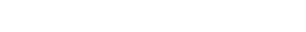
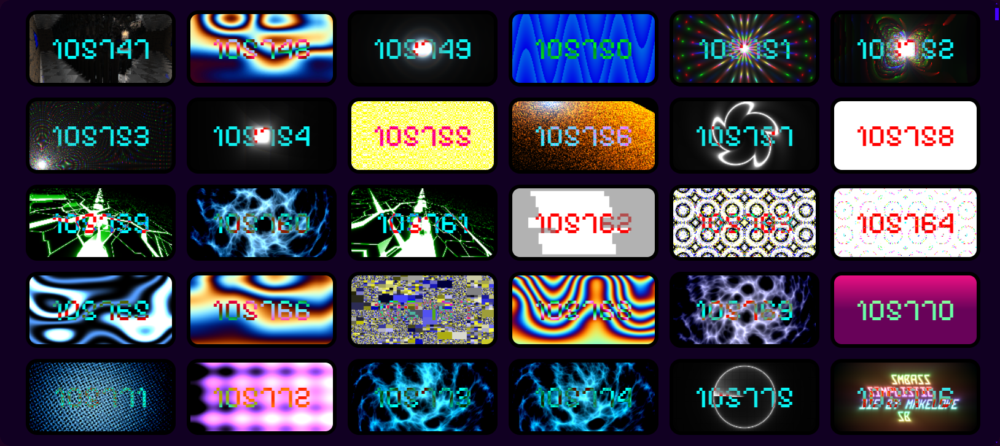
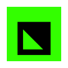

    
     
    <a href="https://metaory.github.io/glslmine">
        <small><i>metaory.github.io/glslmine</i></small>
    </a>
     
    <h2>Modern GLSL shader gallery</h2>

| Features | Sources |
|:---:|:---:|
| • Auto fetch | • GLSL Sandbox |
| • Fast & minimal | • Shadertoy (..) |
| • Smart filters | • Planned .. |

    
     
    
    <small><em>@1738000000</em> <a href="LICENSE">MIT</a></small>

